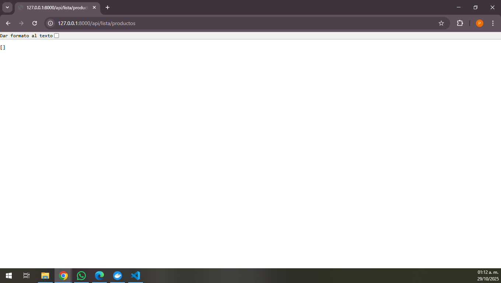
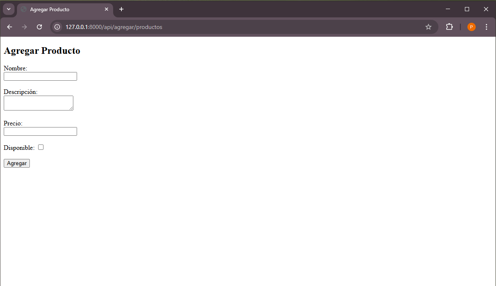
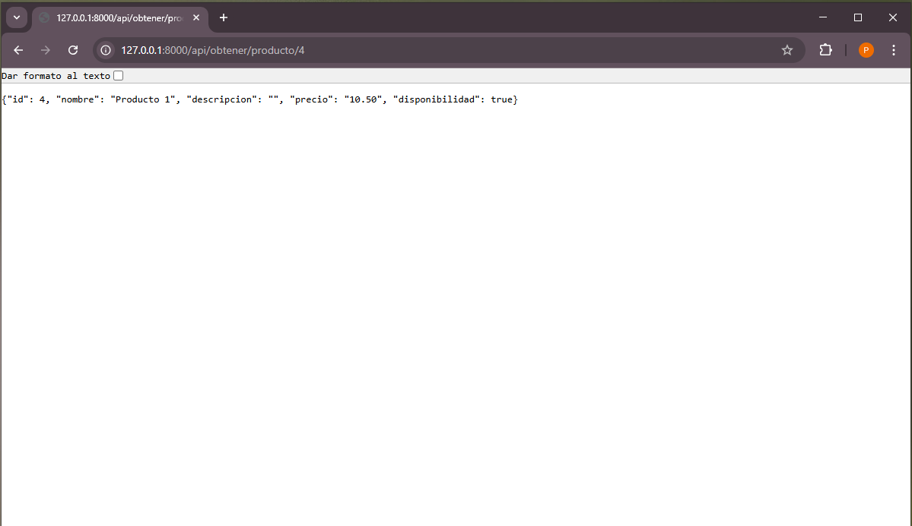
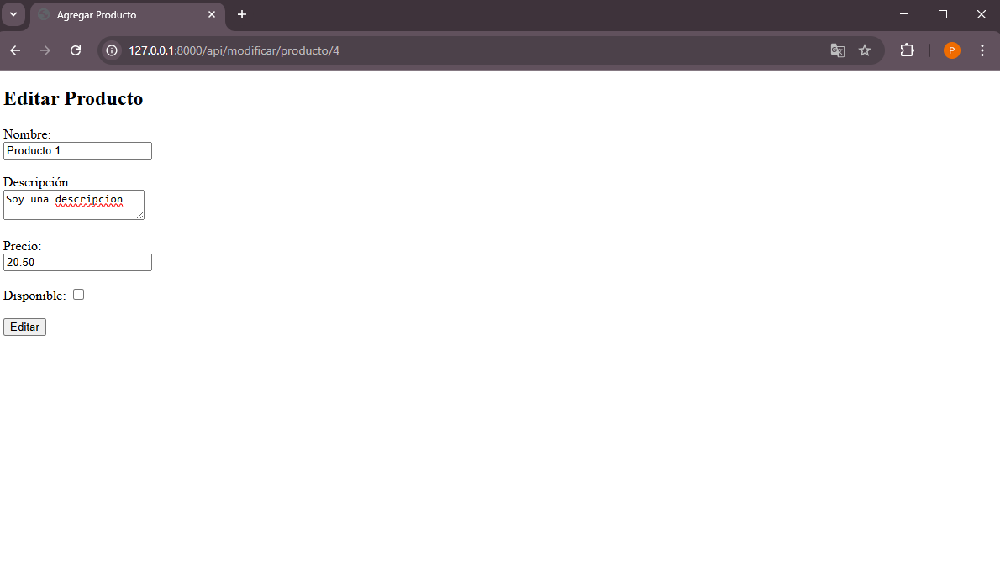
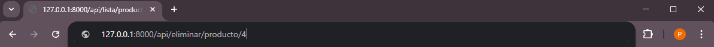

# Prueba Tecnica WolfSellers

Prueba técnica para postulación como desarrollador Python.

## Tecnologías utilizadas

- Python  
- Django  
- SQLite3  

## Instalación

Clona el repositorio y ejecuta los siguientes comandos en tu terminal:

```bash
docker build -t pruebatecnica .
docker run -p 8000:8000 pruebatecnica

## Capturas de pantalla

### Enlistar productos



En esta pantalla se muestra la vista principal de la aplicación después de iniciar el contenedor Docker. Aquí puedes ver cómo Django sirve la página de inicio y la estructura básica del proyecto. Nota: se debe cambiar en enlace del navegador a /api/lista/productos/

---

### Agregar producto


En esta pantalla se renderiza un html para poder poner los datos para su posterior uso en la base de datos para acceder aqui se debe poner en el enlace /api/agregar/productos

Despues podra ver la lista actualizada
(images/Lista_Actualizada.png)

---

### Obtener producto


En esta pantalla se muestra un solo producto para acceder a esta vista en enlace debe ser /api/obtener/producto/<id del producto> en este caso es el 4

---

### Modificar producto


En esta pantalla se vuelve a renderizar el html pero rescatanfo los valores del producto a modificar una vez modificado se actuliza la lista con los valores actualizados para acceder a esta vista en enlace debe ser /api/modificar/producto/<id del producto> en este caso modificamos la descripcion, su precio y su disponibilidad

(images/Lista_Actualizada2.png)

---

### Eliminar producto

Solamente en el enlace se debe poner /api/eliminar/producto/<id del producto> para su posterior eliminacion y actulizacion de la lisa

(images/Lista_Actualizada3.png)


---


---
